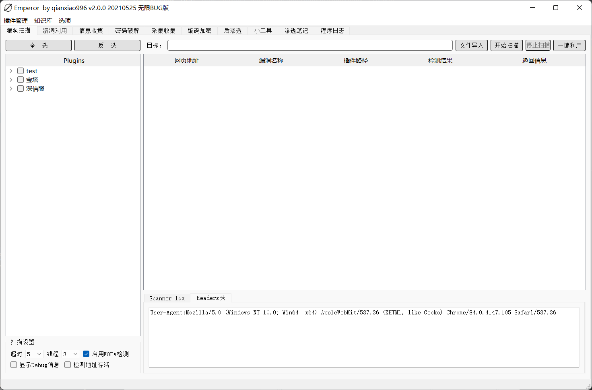
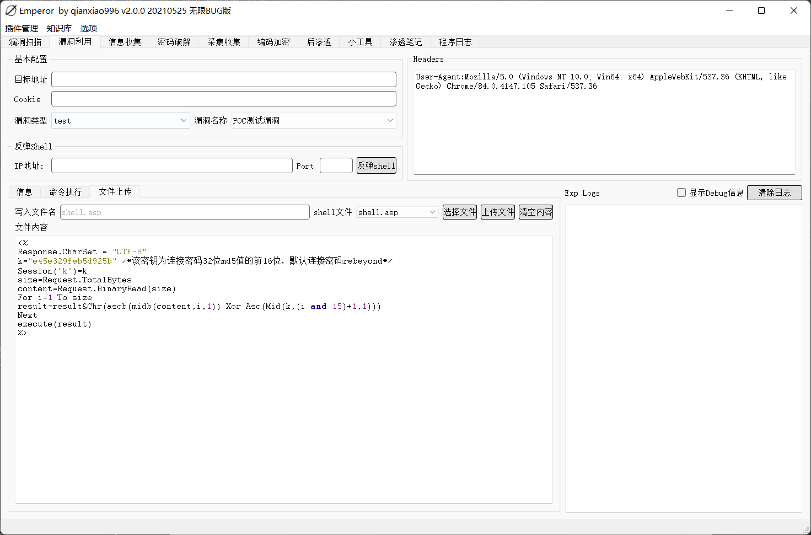
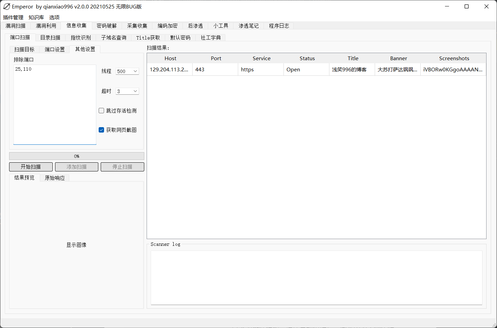
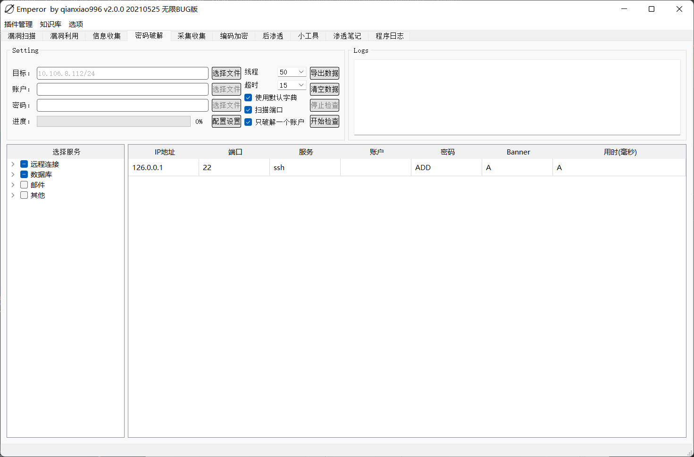

# Emperor

## 工具简介
Emperor为FrameScan-GUI的增强版。是一款渗透测试工具，功能暂未写完。暂未隐藏控制台。没有requirements.txt。因为我自己也不不知道模块调用了哪些哈哈哈。
#### 下载地址：https://github.com/qianxiao996/Emperor/releases

## 支持平台

- Windows  


### 使用方法

下载本项目，运行exe即可。









目录扫描、url采集、命令编码、字典生成暂未编写。

**readme懒得写了，功能请自行探索。**

## 插件

插件模板在/Plugins/Plugins_Template目录下。fofa采集使用前请先配置fofa、shodan、censys、zoomeye的key信息

漏洞扫描利用、子域名插件为内部使用。需要请编写插件联系作者交换。

邮箱地址：qianxiao996@126.com

## 警告！
**请勿用于非法用途！否则自行承担一切后果**


```
exp_data:
    {
        "type":"cmd",  #cmd,shell.uploadfile
        "command":"whoami",  #cmd命令
        "reverse_ip":"127.0.0.1", #反弹shell的ip
        "reverse_port":"8888", #反弹shell的端口
        "filename":"conf.php", #写入文件的名字
        "filename_contents":"shell内容", #shell文件内容
    }
```

# Python selenium 去除driver控制台黑框的方法

https://blog.csdn.net/weixin_39671140/article/details/108083460

文件位置：E:\Python\Python37-64\Lib\site-packages\selenium\webdriver\common\service.py

